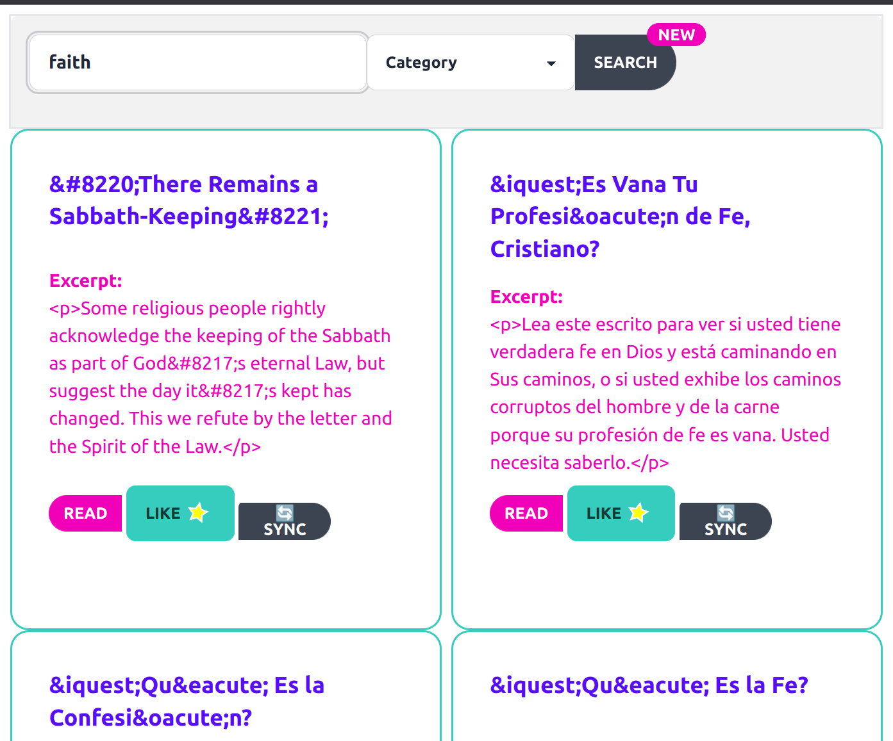

# Goals

1. Provide a search engine that is powered by the associations between Wordpress Pages and Posts like tags, categories,
   related contents, and user 'likes'.

2. Allow the user to anticipate common Wordpress issues, like missing `&nbsp;` for French translations of English pages.

# Deployments

Production - https://tpot-links-mkii-production.up.railway.app/

## Todos

- [ ] Malformed Titles
  - Find $nbsp; and other special chars
  - Place found issues in their own tab
- [ ] Neo4j Query speeds
  - Investigate why neo4j is taking a while on production typeahead search

# Tech Stack

|    Technology    |                                    Purpose |
|:----------------:|-------------------------------------------:|
|       HTMX       |                               AJAX upgrade |
|      DaisyUI      |                         Easy UI Components |
|     AlpineJS     |                                   tiny Vue |
| Insight.Database |                  Dapper and EF replacement |
|   TailwindCSS    |                                    CSS API |
|     Airtable     |             Interact with the Airtable API |
| ElectronNET.API  |                Make this app a Desktop app |
|   Neo4j.Driver   | Searches, relationships and flaw Detection |
|   DotEnv.Core    |                                  Read .env |

